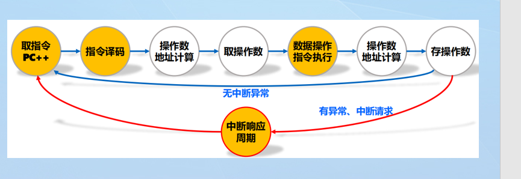

# 导论

## 软硬件概念及各自组成

## 冯诺依曼计算机的特点

**1.** **计算机由五大部件组成**

**2.** **指令和数据以同等地位存于存储器，****可按地址寻访** 

**3.** **指令和数据用二进制表示**

**4.** **指令由操作码和地址码组成**

**5.** **存储程序执行**

**6.** **以运算器为中心**

## **程序与数据都采用二进制代码，计算机如何区分指令和数据？**

1. 时间来源：通过不同的时间段来区分指令和数据，即在取指令阶段（或取指微程序）取出的为指令，在执行指令阶段（或相应微程序）取出的即为数据。

2. 地址来源：由PC提供存储单元地址的取出的是指令，由指令地址码部分提供存储单元地址的取出的是操作数。

–一般将指令和数据分别存放在存储区的不同区域

## 现代计算机硬件框图

## **计算机硬件的主要技术指标**

非时间指标：

1)机器字长指机器一次能处理的二进制位数

  2)总线宽度：数据总线一次能并行传送的最大信息的位数。一般指运算器与存储器之间的数据总线位数。

3)主存容量与存储带宽

主存容量：是指一台计算机主存所包含的存储单元总数。

存储带宽： 指单位时间内与主存交换的二进制信息量，常用单位B/s（字节/秒）。

  影响存储带宽的指标包括数据位宽和数据传输速率

时间指标：

# 第4章

## 层次结构

缓存—主存层次 和 主存—辅存层次

## 主存的基本组成

## 主存的技术指标

## **动态存储器为何刷新？**

依靠电容上的存储电荷存储信息。集成度最高，但信息易失，需要定时刷新内容

## 刷新方式

1. 集中刷新
2. 分散刷新
3. 异步刷新

## 提高访存速度的措施

1. 调整主存结构：低位交叉（交叉读取）、高位交叉（顺序读取）

2. 采用层次结构 Cache –主存

3. 采用高速器件

## catch效率

## catch基本结构

## 替换算法

1. FIFO
2. LRU

# 第5章

## 编址方式

统一编址、独立编址

## I/O设备与主机信息传送的控制方式

程序查询方式、程序中断方式 、 **DMA** 方式

## IO接口的功能和组成

## 接口和端口的概念

## 中断系统的6大基本环节

中断请求、中断屏蔽、中断判优、中断响应、中断处理、中断返回

## 单重中断和多重中断的流程

## DMA接口功能

## DMA接口组成

# 第7章

## 比较基址寻址和变址寻址

# 第8章

## 指令周期流程

## 中断响应条件和时刻

## 中断隐指令

# 第九、十章

##  什么是指令周期、机器周期和时钟周期？三者有何关系？

## 微程序控制器基本概念

## 微程序控制单元的组成

## **后续微指令地址形成方式原理图**

## **微指令序列地址的形成** 

1. 微指令的 下地址字段 指出

2. 根据机器指令的 操作码形成

3. 增量计数器

4. 分支转移

5. 通过测试网络

6. 由硬件产生微程序入口地址

## 微指令的编码方式

直接编码、字段直接编码方式、字段间接编码方式、混合编码